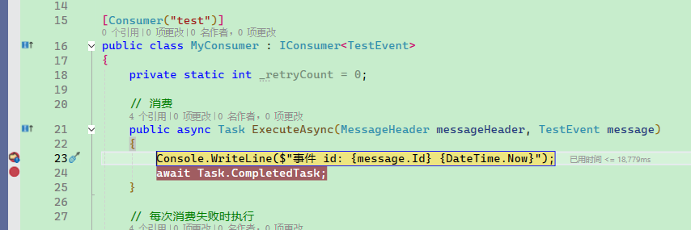

# 快速开始

在本篇教程中，将介绍 Maomi.MQ.RabbitMQ 的使用方法，以便读者能够快速了解该框架的使用方式和特点。

<br />

创建一个 Web 项目（可参考 WebDemo 项目），引入 Maomi.MQ.RabbitMQ 包，在 Web 配置中注入服务：

```csharp
// using Maomi.MQ;
// using RabbitMQ.Client;

builder.Services.AddMaomiMQ((MqOptionsBuilder options) =>
{
    options.WorkId = 1;
    options.AppName = "myapp";
    options.Rabbit = (ConnectionFactory options) =>
    {
        options.HostName = Environment.GetEnvironmentVariable("RABBITMQ")!;
        options.Port = 5672;
        options.ClientProvidedName = Assembly.GetExecutingAssembly().GetName().Name;
    };
}, [typeof(Program).Assembly]);

var app = builder.Build();
```

<br />

* WorkId： 指定用于生成分布式雪花 id 的节点 id，默认为 0。

  > 每条消息生成一个唯一的 id，便于追踪。如果不设置雪花id，在分布式服务中，多实例并行工作时，可能会产生相同的 id。

* AppName：用于标识消息的生产者，以及在日志和链路追踪中标识消息的生产者或消费者。

* Rabbit：RabbitMQ 客户端配置，请参考 [ConnectionFactory](https://rabbitmq.github.io/rabbitmq-dotnet-client/api/RabbitMQ.Client.ConnectionFactory.html)。


定义消息模型类，模型类是 MQ 通讯的消息基础，该模型类将会被序列化为二进制内容传递到 RabbitMQ 服务器中。

```csharp
public class TestEvent
{
    public int Id { get; set; }

    public override string ToString()
    {
        return Id.ToString();
    }
}
```

<br />

定义消费者，消费者需要实现 `IConsumer<TEvent>` 接口，以及使用 `[Consumer]` 特性注解配置消费者属性，如下所示，`[Consumer("test")]` 表示该消费者订阅的队列名称是 `test`。

 `IConsumer<TEvent>` 接口有三个方法，`ExecuteAsync` 方法用于处理消息，`FaildAsync` 会在 `ExecuteAsync` 异常时立即执行，如果代码一直异常，最终会调用 `FallbackAsync` 方法，Maomi.MQ 框架会根据 ConsumerState 值确定是否将消息放回队列重新消费，或者做其它处理动作。

```csharp
[Consumer("test")]
public class MyConsumer : IConsumer<TestEvent>
{
    // 消费
    public async Task ExecuteAsync(MessageHeader messageHeader, TestEvent message)
    {
        Console.WriteLine($"事件 id: {message.Id} {DateTime.Now}");
        await Task.CompletedTask;
    }

    // 每次消费失败时执行
    public Task FaildAsync(MessageHeader messageHeader, Exception ex, int retryCount, TestEvent message) 
        => Task.CompletedTask;

    // 补偿
    public Task<ConsumerState> FallbackAsync(MessageHeader messageHeader, TestEvent? message, Exception? ex) 
        => Task.FromResult( ConsumerState.Ack);
}
```

> Maomi.MQ 还具有多种消费者模式，代码写法不一样，后续会详细讲解不同的消费者模式。

<br />

如果要发布消息，只需要注入 IMessagePublisher 服务即可。

```csharp
[ApiController]
[Route("[controller]")]
public class IndexController : ControllerBase
{
    private readonly IMessagePublisher _messagePublisher;

    public IndexController(IMessagePublisher messagePublisher)
    {
        _messagePublisher = messagePublisher;
    }

    [HttpGet("publish")]
    public async Task<string> Publisher()
    {
        // 发布消息
        await _messagePublisher.PublishAsync(exchange: string.Empty, routingKey: "test", message: new TestEvent
        {
            Id = 123
        });
        return "ok";
    }
}
```

<br />

启动 Web 服务，在 swagger 页面上请求 API 接口，MyConsumer 服务会立即接收到发布的消息。



<br />

如果是控制台项目，则需要引入 Microsoft.Extensions.Hosting 包，以便让消费者在后台订阅队列消费消息。

> 参考 ConsoleDemo 项目。

```csharp
using Maomi.MQ;
using Microsoft.Extensions.Hosting;
using Microsoft.Extensions.Logging;
using RabbitMQ.Client;
using System.Reflection;

var host = new HostBuilder()
    .ConfigureLogging(options =>
    {
        options.AddConsole();
        options.AddDebug();
    })
    .ConfigureServices(services =>
    {
        services.AddMaomiMQ(options =>
        {
            options.WorkId = 1;
            options.AppName = "myapp";
            options.Rabbit = (ConnectionFactory options) =>
            {
                options.HostName = Environment.GetEnvironmentVariable("RABBITMQ")!;
                options.Port = 5672;
                options.ClientProvidedName = Assembly.GetExecutingAssembly().GetName().Name;
            };
        }, new System.Reflection.Assembly[] { typeof(Program).Assembly });

    }).Build();

// 后台运行
var task =  host.RunAsync();

Console.ReadLine();
```


