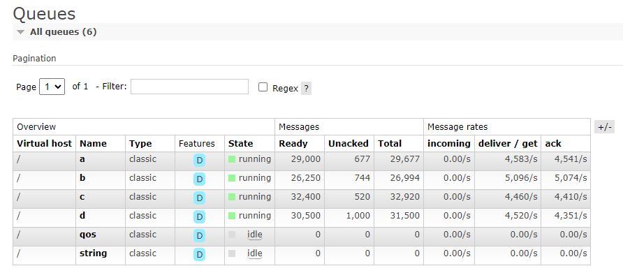

# 消费者

Maomi.MQ.RabbitMQ 中，有三种消费模式，分别是消费者模式、事件模式（事件总线模式）、动态消费者模式，其中动态消费者模式也支持了多种消费模式。

下面简单介绍这三种模式的使用方法，后面会更加详细地介绍。

<br />

### 消费者模式

消费者服务需要实现 `IConsumer<TEvent>` 接口，并且配置 `[Consumer("queue")]` 特性绑定队列名称，通过消费者对象来控制消费行为，消费者模式有具有失败通知和补偿能力，使用上也比较简单。

> 在运行时可以修改配置 ` [ConsumerAttribute]`。

```csharp
public class TestEvent
{
    public int Id { get; set; }
}

[Consumer("PublisherWeb", Qos = 1, RetryFaildRequeue = true)]
public class MyConsumer : IConsumer<TestEvent>
{
    private static int _retryCount = 0;

    // 消费
    public async Task ExecuteAsync(MessageHeader messageHeader, TestEvent message)
    {
        _retryCount++;
        Console.WriteLine($"执行次数:{_retryCount} 事件 id: {message.Id} {DateTime.Now}");
        await Task.CompletedTask;
    }

    // 每次消费失败时执行
    public Task FaildAsync(MessageHeader messageHeader, Exception ex, int retryCount, TestEvent message)
        => Task.CompletedTask;

    // 补偿
    public Task<ConsumerState> FallbackAsync(MessageHeader messageHeader, TestEvent? message, Exception? ex)
        => Task.FromResult(ConsumerState.Ack);
}
```

<br />

### 事件模式

事件模式是通过事件总线的方式实现的，以事件模型为中心，通过事件来控制消费行为。

```csharp
[EventTopic("web2", Qos = 1, RetryFaildRequeue = true)]
public class TestEvent
{
	public string Message { get; set; }
}
```

<br />

然后使用 `[EventOrder]` 特性编排事件执行顺序。

```csharp
// 编排事件消费顺序
[EventOrder(0)]
public class My1EventEventHandler : IEventHandler<TestEvent>
{
	public async Task CancelAsync(TestEvent @event, CancellationToken cancellationToken)
	{
	}

	public async Task ExecuteAsync(TestEvent @event, CancellationToken cancellationToken)
	{
		Console.WriteLine($"{@event.Id},事件 1 已被执行");
	}
}

[EventOrder(1)]
public class My2EventEventHandler : IEventHandler<TestEvent>
{
	public async Task CancelAsync(TestEvent @event, CancellationToken cancellationToken)
	{
	}

	public async Task ExecuteAsync(TestEvent @event, CancellationToken cancellationToken)
	{
		Console.WriteLine($"{@event.Id},事件 2 已被执行");
	}
}
```

<br />

当然，事件模式也可以通过创建中间件增加补偿功能，通过中间件还可以将所有排序事件放到同一个事务中，一起成功或失败，避免事件执行时出现程序退出导致的一致性问题。

```csharp
public class TestEventMiddleware : IEventMiddleware<TestEvent>
{
    private readonly BloggingContext _bloggingContext;

    public TestEventMiddleware(BloggingContext bloggingContext)
    {
        _bloggingContext = bloggingContext;
    }

    public async Task ExecuteAsync(MessageHeader messageHeader, TMessage message, EventHandlerDelegate<TMessage> next)
    {
        using (var transaction = _bloggingContext.Database.BeginTransaction())
        {
            await next(@event, CancellationToken.None);
            await transaction.CommitAsync();
        }
    }

    public Task FaildAsync(MessageHeader messageHeader, Exception ex, int retryCount, TMessage? message)
    {
        return Task.CompletedTask;
    }

    public Task<ConsumerState> FallbackAsync(MessageHeader messageHeader, TMessage? message, Exception? ex)
    {
        return Task.FromResult(true);
    }
}
```

<br />


消费者模式和事件总线模式都可以应对大容量的消息，如下图所示，每个消息接近 500kb，多个队列并发拉取消费。


<br />

如果消息内容不大，则可以达到很高的消费速度。



### 动态消费者

动态消费者可以在运行期间动态订阅队列，并且支持消费者类型、事件总线类型、函数绑定三种方式

注入 IDynamicConsumer 即可使用动态消费者服务。

```csharp
await _dynamicConsumer.ConsumerAsync<MyConsumer, TestEvent>(new ConsumerOptions("myqueue")
{
	Qos = 10
});
```

```csharp
// 自动事件模型对应消费者
await _dynamicConsumer.ConsumerAsync<TestEvent>(new ConsumerOptions("myqueue")
{
	Qos = 10
});
```

```csharp
// 函数方式消费
_dynamicConsumer.ConsumerAsync<TestEvent>(new ConsumerOptions("myqueue")
{
	Qos = 10
}, async (header, message) =>
{
	Console.WriteLine($"事件 id: {message.Id} {DateTime.Now}");
	await Task.CompletedTask;
});
```


### 消费者注册模式

Maomi.MQ 提供了 ITypeFilter 接口，开发者可以使用该接口实现自定义消费者注册模式。

Maomi.MQ 内置三个 ITypeFilter，分别是：

* 消费者模式 ConsumerTypeFilter
* 事件总线模式 EventBusTypeFilter
* 自定义消费者模式 ConsumerTypeFilter

<br />

框架默认注册 ConsumerTypeFilter、EventBusTypeFilter 两种模式，开发者可以自行调整决定使用哪种模式。

```csharp
var consumerTypeFilter = new ConsumerTypeFilter();
// ...
builder.Services.AddMaomiMQ((MqOptionsBuilder options) =>
{
    // ... ...
}, 
[typeof(Program).Assembly], 	// 要自动扫描的程序集
[new ConsumerTypeFilter(), new EventBusTypeFilter(), consumerTypeFilter]); 	// 配置要使用的消费者注册模式
```

