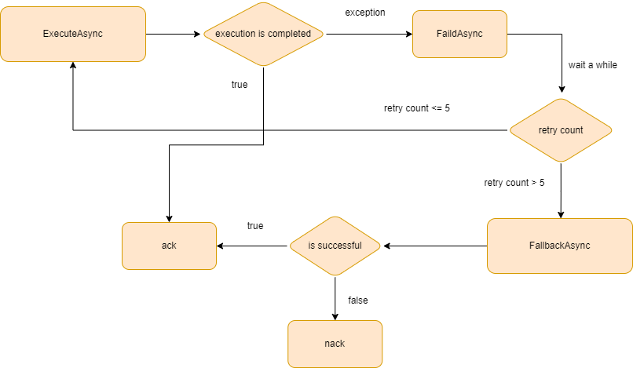

# 消费者模式

消费者模式要求服务实现 `IConsumer<TEvent>` 接口，并添加 `[Connsumer]` 特性。


`IConsumer<TEvent>` 接口比较简单，其定义如下：

```csharp
public interface IConsumer<TEvent>
    where TEvent : class
{
    // 消息处理.
    public Task ExecuteAsync(EventBody<TEvent> message);

    // ExecuteAsync 异常后立即执行此代码.
    public Task FaildAsync(Exception ex, int retryCount, EventBody<TEvent>? message);

    // 最后一次重试失败时执行，用于补偿.
    public Task<bool> FallbackAsync(EventBody<TEvent>? message);
}
```


使用消费者模式时，需要先定义一个模型类，用于发布者和消费者之间传递消息，事件模型类只要是类即可，能够正常序列化和反序列化，没有其它要求。

```csharp
public class TestEvent
{
	public int Id { get; set; }

	public override string ToString()
	{
		return Id.ToString();
	}
}
```


然后继承 `IConsumer<TEvent>` 接口实现消费者功能：

```csharp
[Consumer("web1", Qos = 1)]
public class MyConsumer : IConsumer<TestEvent>
{
	// 消费
	public async Task ExecuteAsync(EventBody<TestEvent> message)
	{
		Console.WriteLine(message.Body.Id);
	}

	// 每次失败时被执行
	public async Task FaildAsync(Exception ex, int retryCount, EventBody<TestEvent>? message)
	{
		Console.WriteLine($"重试 {message.Body.Id}，次数 {retryCount}");
		await Task.CompletedTask;
	}

	// 最后一次失败时执行
	public async Task<bool> FallbackAsync(EventBody<TestEvent>? message)
	{
		Console.WriteLine($"最后一次 {message.Body.Id}");
        // 如果返回 true，说明补偿成功。
		return true;
	}
}
```


特性配置的说明请参考 [消费者配置](3.configuration.md#消费者配置) 。


### 消费、重试和补偿

消费者收到服务器推送的消息时，`ExecuteAsync` 方法会被自动执行。当 `ExecuteAsync` 执行异常时，`FaildAsync` 方法会马上被触发，开发者可以利用 `FaildAsync` 记录相关日志信息。

```csharp
// 每次失败时被执行
public async Task FaildAsync(Exception ex, int retryCount, EventBody<TestEvent>? message)
{
	// 当 retryCount == -1 时，错误并非是 ExecuteAsync 方法导致的
	if (retryCount == -1)
	{
		_logger.LogError(ex, "Consumer error,event id: {Id}", message?.Id);

		// 可以在此处添加告警通知代码
		await Task.Delay(1000);
	}
	else
	{
		_logger.LogError(ex, "Consumer exception,event id: {Id},retry count: {retryCount}", message!.Id, retryCount);
	}
}
```


如果 `FaildAsync` 方法也出现异常时，不会影响整体流程，框架会等待到达间隔时间后继续重试 `ExecuteAsync` 方法。

建议 `FaildAsync` 使用 `try{}cathc{}` 套住代码，不要对外抛出异常，`FaildAsync` 的逻辑不要包含太多逻辑，并且 `FaildAsync` 只应记录日志或进行告警使用。


`FaildAsync` 被执行有一个额外情况，就是在消费消息之前就已经发生错误，例如一个事件模型类有构造函数导致不能被反序列化，这个时候 `FaildAsync` 会被立即执行，且 `retryCount = -1`。


当 `ExecuteAsync` 方法执行异常时，框架会自动重试，默认会重试五次，如果五次都失败，则会执行 `FallbackAsync` 方法进行补偿。

重试间隔时间会逐渐增大，请参考 [重试](5.retry.md)。


当重试五次之后，就会立即启动补偿机制。

```csharp
// 最后一次失败时执行
public async Task<bool> FallbackAsync(EventBody<TestEvent>? message)
{
	return true;
}
```


`FallbackAsync` 方法需要返回 bool，如果返回 `true` ，表示虽然 `ExecuteAsync` 出现异常，但是 `FallbackAsync` 补偿后已经正常，该消息会被正常消费掉。如果返回 `false`，则说补偿失败，该消息按照消费失败处理。

只有 `ExecuteAsync` 异常时，才会触发 `FaildAsync`  和 `FallbackAsync` ，如果是在处理消息之前的异常，会直接失败。





### 消费失败

当 `ExecuteAsync` 失败次数达到阈值时，并且 `FallbackAsync` 返回 `false`，则该条消息消费失败，或者由于序列化等错误时直接失败。


在 `[Consumer]` 特性中有三个很重要的配置：

```csharp
public class ConsumerAttribute : Attribute
{
    // 消费失败次数达到条件时，是否放回队列.
    public bool RetryFaildRequeue { get; set; }

    // 现异常时是否放回队列，例如序列化错误等原因导致的，而不是消费时发生异常导致的.
    public bool ExecptionRequeue { get; set; }  = true;
    
    // 绑定死信队列.
    public string? DeadQueue { get; set; }
}
```


当 `ExecuteAsync` 失败次数达到阈值时，并且 `FallbackAsync` 返回 `false`，则该条消息消费失败。

如果  `RetryFaildRequeue == false`，那么该条消息会被 RabbitMQ 丢弃。

> 如果绑定了死信队列，则会先推送到死信队列，接着再丢弃。


如果 `RetryFaildRequeue == true`，那么该条消息会被返回 RabbbitMQ 队列中，等待下一次消费。

> 由于消息失败后会被放回队列，因此绑定的死信队列不会收到该消息。


当序列化异常或者其它问题导致错误而不能进入 `ExecuteAsync` 方法时，`FaildAsync` 方法会首先被触发一次，此时 retryCount 参数值为 `-1`。

出现此种问题时，一般是开发者 bug 导致的，不会进行补偿等操作，开发者可以在 `FaildAsync` 中处理该事件，记录相关日志信息。

```csharp
// 每次失败时被执行，或者出现无法进入 ExecuteAsync 的异常
public async Task FaildAsync(Exception ex, int retryCount, EventBody<TestEvent>? message)
{
	// 当 retryCount == -1 时，错误并非是 ExecuteAsync 方法导致的
	if (retryCount == -1)
	{
		_logger.LogError(ex, "Consumer error,event id: {Id}", message?.Id);

		// 可以在此处添加告警通知代码
		await Task.Delay(1000);
	}
	else
	{
		_logger.LogError(ex, "Consumer exception,event id: {Id},retry count: {retryCount}", message!.Id, retryCount);
	}
}
```


由于这种情况不妥善处理，会导致消息丢失，因此框架默认将 `ExecptionRequeue` 设置为 `true`，也就是说出现这种异常时，消息会被放回队列。如果问题一致没有得到解决，则会出现循环：调用 `FaildAsync` 、放回队列、调用 `FaildAsync` 、放回队列... ...


所以应该在 `FaildAsync` 中添加代码通知开发者相关信息，并且设置间隔时间，避免重试太频繁。


### 自动创建队列

框架默认会自动创建队列，如果需要关闭自动创建功能，把 `AutoQueueDeclare` 设置为 `false` 即可。

```csharp
builder.Services.AddMaomiMQ((MqOptionsBuilder options) =>
{
	options.WorkId = 1;
	options.AppName = "myapp";
	options.AutoQueueDeclare = false;
	options.Rabbit = (ConnectionFactory options) =>
	{
		options.HostName = "192.168.3.248";
		options.ClientProvidedName = Assembly.GetExecutingAssembly().GetName().Name;
	};
}, [typeof(Program).Assembly]);
```


当然还可以单独为消费者配置是否自动创建队列：

```csharp
[Consumer("ConsumerWeb_create", AutoQueueDeclare = AutoQueueDeclare.Enable)]
```


默认情况下，关闭了全局自动创建，则不会自动创建队列。

如果关闭全局自动创建，但是消费者配置了 `AutoQueueDeclare = AutoQueueDeclare.Enable`，则还是会自动创建队列。

如果消费者配置了 `AutoQueueDeclare = AutoQueueDeclare.Disable` ，则会忽略全局配置，不会创建队列。


### Qos

让程序需要严格根据顺序消费时，可以使用 `Qos = 1`，框架会严格保证逐条消费，如果程序不需要顺序消费，希望可以快速处理所有消息，则可以将 Qos 设置大一些。由于 Qos 和重试、补偿机制组合使用会有多种情况，因此请参考 [重试](5.retry.md)。


Qos 是通过特性来配置的：

```csharp
[Consumer("ConsumerWeb", Qos = 1)]
```


可以通过调高 Qos 值，让程序在可以并发消息，提高并发量。


### 延迟队列

延迟队列有两种，一种设置消息过期时间，一种是设置队列过期时间。

设置消息过期时间，那么该消息在一定时间没有被消费时，会被丢弃或移动到死信队列中，该配置只对单个消息有效，请参考 [消息过期](2.publisher.md#消息过期)。

队列设置过期后，当消息在一定时间内没有被消费时，会被丢弃或移动到死信队列中，该配置只对所有消息有效。基于这一点，我们可以实现延迟队列。


首先创建消费者，继承 EmptyConsumer，那么该队列会在程序启动时被创建，但是不会创建 IConnection 进行消费。然后设置队列消息过期时间以及绑定死信队列，绑定的死信队列既可以使用消费者模式实现，也可以使用事件模式实现。

```csharp
[Consumer("ConsumerWeb_dead_2", Expiration = 6000, DeadQueue = "ConsumerWeb_dead_queue_2")]
public class EmptyDeadConsumer : EmptyConsumer<DeadEvent>
{
}

// ConsumerWeb_dead 消费失败的消息会被此消费者消费。
[Consumer("ConsumerWeb_dead_queue_2", Qos = 1)]
public class Dead_2_QueueConsumer : IConsumer<DeadQueueEvent>
{
    // 消费
    public Task ExecuteAsync(EventBody<DeadQueueEvent> message)
    {
        Console.WriteLine($"死信队列，事件 id:{message.Id}");
        return Task.CompletedTask;
    }

    // 每次失败时被执行
    public Task FaildAsync(Exception ex, int retryCount, EventBody<DeadQueueEvent>? message) => Task.CompletedTask;

    // 最后一次失败时执行
    public Task<bool> FallbackAsync(EventBody<DeadQueueEvent>? message) => Task.FromResult(false);
}
```


### 空消费者

当识别到空消费者时，框架只会创建队列，而不会启动消费者消费消息。

可以结合延迟队列一起使用，该队列不会有任何消费者，当该队列的消息过期时，都由死信队列直接消费，示例如下：

```csharp
[Consumer("ConsumerWeb_empty", Expiration = 6000, DeadQueue = "ConsumerWeb_empty_dead")]
public class MyEmptyConsumer : EmptyConsumer<TestEvent> { }

[Consumer("ConsumerWeb_empty_dead", Qos = 10)]
public class MyDeadConsumer : IConsumer<TestEvent>
{
	public Task ExecuteAsync(EventBody<TestEvent> message) => Task.CompletedTask;

	public Task FaildAsync(Exception ex, int retryCount, EventBody<TestEvent>? message) => Task.CompletedTask;

	public Task<bool> FallbackAsync(EventBody<TestEvent>? message) => Task.FromResult(true);
}
```


对于跨进程的队列，A 服务不消费只发布，B 服务负责消费，A 服务中可以加一个空消费者，保证 A 服务启动时该队列一定存在，另一方面，消费者服务不应该关注队列的定义，也不太应该创建队列。


### 分组

通过配置 `Group` 属性将多个消费者放到同一个连接通道中执行，对于那些并发量不高的队列，复用连接通道可以降低资源消耗。


示例：

```csharp
[Consumer("ConsumerWeb_group_1", Qos = 1, Group = "group")]
public class Group_1_Consumer : IConsumer<GroupEvent>
{
}

[Consumer("ConsumerWeb_group_2", Qos = 1, Group = "group")]
public class Group_2_Consumer : IConsumer<GroupEvent>
{
}
```


### 广播模式

在 RabbitMQ 中，设置一个 Fanout 交换器之后，多个队列绑定到该交换器时，每个队列都会收到一模一样的消息，在微服务场景下，比如用户中心，员工离职后，需要发布一个消息，所有订阅了这个消息的系统都要处理员工离职后的相关数据。


创建两个消费者队列，队列的名称不能相同，然后绑定到同一个交换器，名称可以随意，例如 `exchange`。

```csharp
[Consumer("ConsumerWeb_exchange_1", BindExchange = "exchange")]
public class Exchange_1_Consumer : IConsumer<TestEvent>
{
    public Task ExecuteAsync(EventBody<TestEvent> message)
    {
        Console.WriteLine($"[1]: {message.Id}");
        return Task.CompletedTask;
    }

    public Task FaildAsync(Exception ex, int retryCount, EventBody<TestEvent>? message) => Task.CompletedTask;

    public Task<bool> FallbackAsync(EventBody<TestEvent>? message) => Task.FromResult(true);
}

[Consumer("ConsumerWeb_exchange_2", BindExchange = "exchange")]
public class Exchange_2_Consumer : IConsumer<TestEvent>
{
    public Task ExecuteAsync(EventBody<TestEvent> message)
    {
        Console.WriteLine($"[2]: {message.Id}");
        return Task.CompletedTask;
    }

    public Task FaildAsync(Exception ex, int retryCount, EventBody<TestEvent>? message) => Task.CompletedTask;

    public Task<bool> FallbackAsync(EventBody<TestEvent>? message) => Task.FromResult(true);
}
```


发布者发布消息时，需要使用广播发布者模式发布，请参考：[广播模式](2.publisher.md#广播模式)
