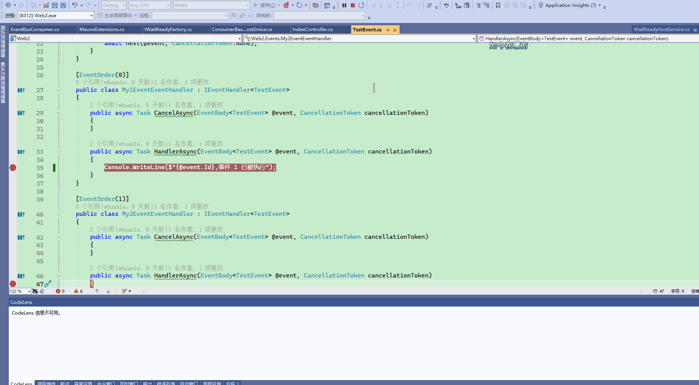

# 基于事件

Maomi.MQ 内部设计了一个事件总线，可以帮助开发者实现事件编排、实现本地事务、正向执行和补偿。

示例请参考 `example/2/Web2`。

首先定义一个事件模型，事件需要使用 `[EventTopic]` 标识，并设置该事件对于的队列名称。

```csharp
[EventTopic("web2")]
public class TestEvent
{
	public string Message { get; set; }

	public override string ToString()
	{
		return Message;
	}
}
```


然后编排事件执行器：

```csharp
    [EventOrder(0)]
    public class My1EventEventHandler : IEventHandler<TestEvent>
    {
        public async Task CancelAsync(EventBody<TestEvent> @event, CancellationToken cancellationToken)
        {
        }

        public async Task HandlerAsync(EventBody<TestEvent> @event, CancellationToken cancellationToken)
        {
        }
    }

    [EventOrder(1)]
    public class My2EventEventHandler : IEventHandler<TestEvent>
    {
        public async Task CancelAsync(EventBody<TestEvent> @event, CancellationToken cancellationToken)
        {
        }

        public async Task HandlerAsync(EventBody<TestEvent> @event, CancellationToken cancellationToken)
        {
        }
    }
```


每个事件执行器都必须实现 `IEventHandler<T>` 接口，并且设置 `[EventOrder]` 特性以便确认事件的执行顺序。




## 中间件


中间件的作用是便于开发者拦截事件、记录信息、实现本地事务等。

示例代码：

```csharp
    public class TestEventMiddleware : IEventMiddleware<TestEvent>
    {
        public async Task HandleAsync(EventBody<TestEvent> @event, EventHandlerDelegate<TestEvent> next)
        {
            await next(@event, CancellationToken.None);
        }
    }
```


在中间件中调用 `next()` 委托时，框架开始按顺序执行事件，即前面提到的 `My1EventEventHandler`、`My2EventEventHandler`。

例如，在中间件中注入数据库上下文，然后启动事务执行数据库操作，当其中一个 EventHandler 执行失败时，执行链路会回滚，同时不会提交事务。

```csharp
public class TestEventMiddleware : IEventMiddleware<TestEvent>
{
    private readonly BloggingContext _bloggingContext;

    public TestEventMiddleware(BloggingContext bloggingContext)
    {
        _bloggingContext = bloggingContext;
    }

    public async Task HandleAsync(EventBody<TestEvent> @event, EventHandlerDelegate<TestEvent> next)
    {
        using (var transaction = _bloggingContext.Database.BeginTransaction())
        {
            await next(@event, CancellationToken.None);
            await transaction.CommitAsync();
        }
    }

    public Task FaildAsync(Exception ex, int retryCount, EventBody<TestEvent>? message)
    {
        return Task.CompletedTask;
    }

    public Task<bool> FallbackAsync(EventBody<TestEvent>? message)
    {
        return Task.FromResult(true);
    }
}

[EventOrder(0)]
public class My1EventEventHandler : IEventHandler<TestEvent>
{
    private readonly BloggingContext _bloggingContext;

    public My1EventEventHandler(BloggingContext bloggingContext)
    {
        _bloggingContext = bloggingContext;
    }

    public async Task CancelAsync(EventBody<TestEvent> @event, CancellationToken cancellationToken)
    {
        Console.WriteLine($"{@event.Id} 被补偿,[1]");
    }

    public async Task HandlerAsync(EventBody<TestEvent> @event, CancellationToken cancellationToken)
    {
        await _bloggingContext.Posts.AddAsync(new Post
        {
            Title = "鲁滨逊漂流记",
            Content = "随便写写就对了"
        });
        await _bloggingContext.SaveChangesAsync();
    }
}

[EventOrder(1)]
public class My2EventEventHandler : IEventHandler<TestEvent>
{
    private readonly BloggingContext _bloggingContext;

    public My2EventEventHandler(BloggingContext bloggingContext)
    {
        _bloggingContext = bloggingContext;
    }
    public async Task CancelAsync(EventBody<TestEvent> @event, CancellationToken cancellationToken)
    {
        Console.WriteLine($"{@event.Id} 被补偿,[2]");
    }

    public async Task HandlerAsync(EventBody<TestEvent> @event, CancellationToken cancellationToken)
    {
        await _bloggingContext.Posts.AddAsync(new Post
        {
            Title = "红楼梦",
            Content = "贾宝玉初试云雨情"
        });
        await _bloggingContext.SaveChangesAsync();

        throw new OperationCanceledException("故意报错");
    }
}
```


事件执行时，如果出现异常，也是会被重试的，中间件 TestEventMiddleware 的 FaildAsync、FallbackAsync 会被依次执行。

