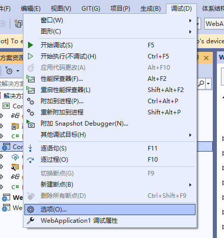
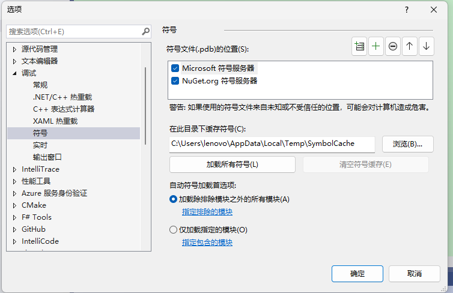
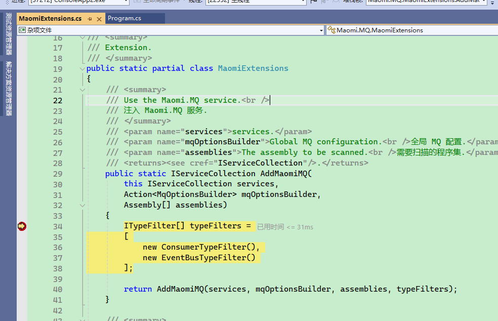
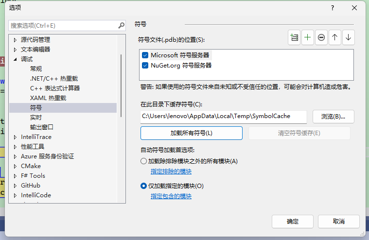

# 配置

在引入 Maomi.MQ 框架时，可以配置相关属性，示例和说明如下：


```csharp
// this.
builder.Services.AddMaomiMQ((MqOptionsBuilder options) =>
{
    // 必填，当前程序节点，用于配置分布式雪花 id，
    // 配置 WorkId 可以避免高并发情况下同一个消息的 id 重复。
	options.WorkId = 1;
    
    // 是否自动创建队列
	options.AutoQueueDeclare = true;
    
    // 当前应用名称，用于标识消息的发布者和消费者程序
	options.AppName = "myapp";
    
    // 常驻连接池的连接对象数量，默认是 Environment.ProcessorCount * 2
    options.PoolMaximumRetained = 20;
    
    // 必填，RabbitMQ 配置
	options.Rabbit = (ConnectionFactory options) =>
	{
		options.HostName = "192.168.3.248";
		options.ClientProvidedName = Assembly.GetExecutingAssembly().GetName().Name;
	};
}, [typeof(Program).Assembly]);  // 要被扫描的程序集
```


### 拦截器

Maomi.MQ 默认启用消费者模式和事件总线模式，开发者可以自由配置是否启用。

```csharp
builder.Services.AddMaomiMQ((MqOptionsBuilder options) =>
{
	options.WorkId = 1;
	options.AutoQueueDeclare = true;
	options.AppName = "myapp";
	options.Rabbit = (ConnectionFactory options) =>
	{
		options.HostName = "10.1.0.6";
		options.ClientProvidedName = Assembly.GetExecutingAssembly().GetName().Name;
	};
},
[typeof(Program).Assembly], 
[new ConsumerTypeFilter(), new EventBusTypeFilter()]); // 注入消费者模式和事件总线模式
```


另外框架还提供了动态配置拦截，可以实现在程序启动时修改消费者特性的配置。

```csharp
builder.Services.AddMaomiMQ((MqOptionsBuilder options) =>
{
	options.WorkId = 1;
	options.AutoQueueDeclare = true;
	options.AppName = "myapp";
	options.Rabbit = (ConnectionFactory options) =>
	{
		options.HostName = "10.1.0.6";
		options.ClientProvidedName = Assembly.GetExecutingAssembly().GetName().Name;
	};
},
[typeof(Program).Assembly],
[new ConsumerTypeFilter(ConsumerInterceptor), new EventBusTypeFilter(EventInterceptor)]);
```


实现拦截器函数：

```csharp
private static bool ConsumerInterceptor(ConsumerAttribute consumerAttribute, Type consumerType)
{
	if (consumerType == typeof(DynamicConsumer))
	{
		consumerAttribute.Queue = consumerAttribute.Queue + "_1";
	}

	return true;
}

private static bool EventInterceptor(EventTopicAttribute eventTopicAttribute, Type eventType)
{
	if (eventType == typeof(TestEvent))
	{
		eventTopicAttribute.Queue = eventTopicAttribute.Queue + "_1";
	}
	return true;
}
```


开发者可以在拦截器中修改配置值。

拦截器有返回值，当返回 false 时，框架会忽略注册该消费者或事件，也就是该队列不会启动消费者。


###  消费者配置

消费者模式 `[Consumer]` 和事件总线模式 `[EventTopic]` 具有相同的属性配置，其配置说明如下：

| 名称              | 类型             | 必填 | 默认值 | 说明                                                         |
| ----------------- | ---------------- | ---- | ------ | ------------------------------------------------------------ |
| Queue             | string           | 必填 |        | 队列名称                                                     |
| DeadQueue         | string?          | 可选 |        | 绑定死信队列名称                                             |
| ExecptionRequeue  | bool             | 可选 | true   | 出现异常时是否放回队列，例如序列化错误等原因导致的，而不是消费时发生异常导致的 |
| Expiration        | int              | 可选 |        | 队列消息过期时间，单位毫秒                                   |
| Qos               | ushort           | 可选 | 100    | 每次拉取消息时可以拉取的消息的数量，有助于提高消费能力       |
| RetryFaildRequeue | bool             | 可选 | false  | 消费失败次数达到条件时，是否放回队列                         |
| Group             | string?          | 可选 |        | 分组名称                                                     |
| AutoQueueDeclare  | AutoQueueDeclare | 可选 | None   | 是否自动创建队列                                             |
| BindExchange      | string?          | 可选 |        | 绑定交换器名称                                               |


### 环境隔离

> 目前还在考虑要不要支持多租户模式。


在开发中，往往需要在本地调试，本地程序启动后会连接到开发服务器上，一个队列收到消息时，会向其中一个消费者推送消息。那么我本地调试时，发布一个消息后，可能本地程序收不到该消息，而是被开发环境中的程序消费掉了。

这个时候，我们希望可以将本地调试环境跟开发环境隔离开来，可以使用 RabbitMQ 提供的 VirtualHost 功能。


首先通过 put 请求创建一个新的 VirtualHost，请参考文档：https://www.rabbitmq.com/docs/vhosts#using-http-api


然后在代码中配置 VirtualHost：

```csharp
builder.Services.AddMaomiMQ((MqOptionsBuilder options) =>
{
	options.WorkId = 1;
	options.AutoQueueDeclare = true;
	options.AppName = "myapp";
	options.Rabbit = (ConnectionFactory options) =>
	{
		options.HostName = "192.168.3.248";
#if DEBUG
		options.VirtualHost = "debug";
#endif
		options.ClientProvidedName = Assembly.GetExecutingAssembly().GetName().Name;
	};
}, [typeof(Program).Assembly]);
```


### 雪花 id 配置

Maomi.MQ.RabbitMQ 使用了 IdGenerator 生成雪花 id，使得每个事件在集群中都有一个唯一 id。

框架通过 IIdFactory 接口创建雪花 id，你可以通过替换 `IIdFactory` 接口配置雪花 id 生成规则。

```csharp
services.AddSingleton<IIdFactory>(new DefaultIdFactory((ushort)optionsBuilder.WorkId));
```


示例：

```csharp
public class DefaultIdFactory : IIdFactory
{
    /// <summary>
    /// Initializes a new instance of the <see cref="DefaultIdFactory"/> class.
    /// </summary>
    /// <param name="workId"></param>
    public DefaultIdFactory(ushort workId)
    {
        var options = new IdGeneratorOptions(workId) { SeqBitLength = 10 };
        YitIdHelper.SetIdGenerator(options);
    }

    /// <inheritdoc />
    public long NextId() => YitIdHelper.NextId();
}
```


IdGenerator 框架生成雪花 id 配置请参考：

https://github.com/yitter/IdGenerator/tree/master/C%23


### 调试

Maomi.MQ 框架在 nuget.org 中有符号包，需要调试 Maomi.MQ 框架时会非常方便。





第一次使用时建议加载所有模块，并启动程序。




后面可以手动选择只加载那些模块。


F12 到要调试的位置，启动程序后即可进入断点。




如果需要调试 Maomi.MQ.RabbtiMQ，可以在程序中加一个断点（不是在 Maomi.MQ 中），然后等待程序启动到达这个断点后，配置符号，点击加载所有符号。

然后在 Maomi.MQ.RabbitMQ 中设置断点即可进入调试。

