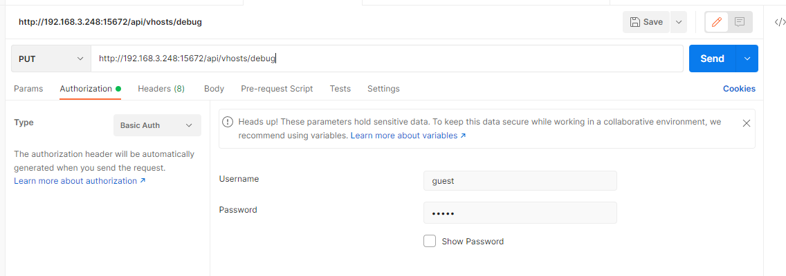
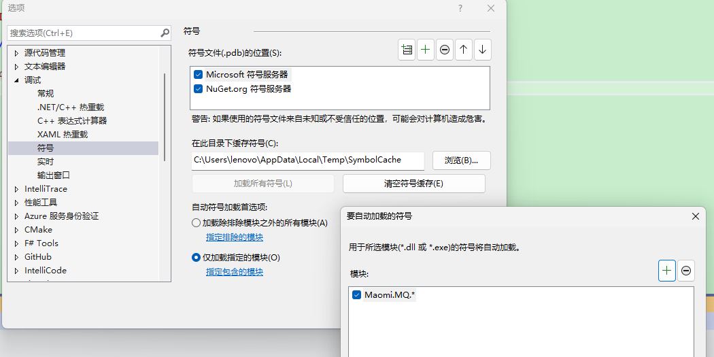

# 配置

在引入 Maomi.MQ 框架时，可以配置相关属性，示例和说明如下：

<br />

```csharp
// this.
builder.Services.AddMaomiMQ((MqOptionsBuilder options) =>
{
    // 必填，当前程序节点，用于配置分布式雪花 id，
    // 配置 WorkId 可以避免高并发情况下同一个消息的 id 重复。
	options.WorkId = 1;
    
    // 是否自动创建队列
	options.AutoQueueDeclare = true;
    
    // 当前应用名称，用于标识消息的发布者和消费者程序
	options.AppName = "myapp";
    
    // 必填，RabbitMQ 配置
	options.Rabbit = (ConnectionFactory options) =>
	{
        options.HostName = Environment.GetEnvironmentVariable("RABBITMQ")!;
        options.Port = 5672;
		options.ClientProvidedName = Assembly.GetExecutingAssembly().GetName().Name;
	};
}, [typeof(Program).Assembly]);  // 要被扫描的程序集
```

<br />

开发者可以通过 ConnectionFactory 手动管理 RabbitMQ 连接，例如故障恢复、自定义连接参数等。


### 类型过滤器

类型过滤器的接口是 ITypeFilter，作用是扫描识别类型，并将其添加为消费者，默认启用 ConsumerTypeFilter、EventBusTypeFilter 两个类型过滤器，它们会识别并使用消费者模型和事件总线消费者模式，这两种模型都要求配置对于的特性注解。

<br />

此外还有一个动态消费者过滤器 DynamicConsumerTypeFilter，可以自定义消费者模型和配置。

<br />

如果开发者需要自定义消费者模型或者接入内存事件总线例如 MediatR ，只需要实现 ITypeFilter 即可。


### 拦截器

Maomi.MQ 默认启用消费者模式和事件总线模式，开发者可以自由配置是否启用。

```csharp
builder.Services.AddMaomiMQ((MqOptionsBuilder options) =>
{
	options.WorkId = 1;
	options.AutoQueueDeclare = true;
	options.AppName = "myapp";
	options.Rabbit = (ConnectionFactory options) =>
	{
        // ... ...
	};
},
[typeof(Program).Assembly], 
[new ConsumerTypeFilter(), new EventBusTypeFilter()]); // 注入消费者模式和事件总线模式
```

<br />

另外框架还提供了动态配置拦截，可以实现在程序启动时修改消费者特性的配置。

```csharp
builder.Services.AddMaomiMQ((MqOptionsBuilder options) =>
{
	options.WorkId = 1;
	options.AutoQueueDeclare = true;
	options.AppName = "myapp";
	options.Rabbit = (ConnectionFactory options) =>
	{
        // ... ...
	};
},
[typeof(Program).Assembly],
[new ConsumerTypeFilter(ConsumerInterceptor), new EventBusTypeFilter(EventInterceptor)]);
```

<br />

实现拦截器函数：

```csharp
private static RegisterQueue ConsumerInterceptor(IConsumerOptions consumerOptions, Type consumerType)
{
	var newConsumerOptions = new ConsumerOptions(consumerOptions.Queue);
	consumerOptions.CopyFrom(newConsumerOptions);

	// 修改 newConsumerOptions 中的配置

	return new RegisterQueue(true, consumerOptions);
}

private static RegisterQueue EventInterceptor(IConsumerOptions consumerOptions, Type eventType)
{
	if (eventType == typeof(TestEvent))
	{
		var newConsumerOptions = new ConsumerOptions(consumerOptions.Queue);
		consumerOptions.CopyFrom(newConsumerOptions);
		newConsumerOptions.Queue = newConsumerOptions.Queue + "_1";

		return new RegisterQueue(true, newConsumerOptions);
	}
	return new RegisterQueue(true, consumerOptions);
}
```

<br />

开发者可以在拦截器中修改配置值。

拦截器有返回值，当返回 false 时，框架会忽略注册该消费者或事件，也就是该队列不会启动消费者。


### 序列化配置

默认情况下，Maomi.MQ 使用 System.Text.Json 序列化和反序列化消息，以便跟 RabbitClient 进行二进制数据交互。

如果读者要切换其它 json 框架，需要自行实现 IMessageSerializer 接口并替换依赖注入，IMessageSerializer 除了包含序列化和反序列化，还需要支持读取 ContentEncoding、ContentType 两个属性。

Maomi.MQ 默认实现如下：

```csharp
public class DefaultMessageSerializer : IMessageSerializer
{
    private static readonly JsonSerializerOptions JsonSerializerOptions = new JsonSerializerOptions
    {
        PropertyNameCaseInsensitive = true,
        AllowTrailingCommas = false,
        IgnoreReadOnlyProperties = true,
        ReadCommentHandling = JsonCommentHandling.Skip,
    };

    /// <inheritdoc />
    public string ContentEncoding => "UTF-8";

    /// <inheritdoc />
    public string ContentType => "application/json";

    /// <inheritdoc />
    public TObject? Deserialize<TObject>(ReadOnlySpan<byte> bytes)
    {
        return System.Text.Json.JsonSerializer.Deserialize<TObject>(bytes, JsonSerializerOptions);
    }

    /// <inheritdoc />
    public byte[] Serializer<TObject>(TObject obj)
    {
        return System.Text.Json.JsonSerializer.SerializeToUtf8Bytes(obj);
    }
}
```

<br />

如果开发者需要使用 Protobuf 做数据交换，可以使用 Maomi.MQ.Message.Protobuf 包，如果要全局使用 Protobuf 做数据交换：

```csharp
builder.Services.AddSingleton<IMessageSerializer, ProtobufMessageSerializer>();
```

<br />

注意， Maomi.MQ.Message.Protobuf 只提供官方的 Google.Protobuf 序列化和反序列化功能，如果使用了 Protobuf.net、ServiceModel.Grpc 等 grpc 框架，请自行参考 ProtobufMessageSerializer 重新实现一个序列化器。

<br />

Maomi.MQ 支持同时使用多个序列化器，参考 ProtoDemo 项目，手动注册 MessageSerializerFactory 服务，并自行根据参数判断要使用何种序列化器，代码如下所示：

```csharp
builder.Services.AddSingleton<IMessageSerializer, MessageSerializerFactory>(s =>
{
	return new MessageSerializerFactory((type) =>
	{
		if (type.IsAssignableTo(typeof(Google.Protobuf.IMessage)))
		{
			return new ProtobufMessageSerializer();
		}
		else
		{
			return new DefaultMessageSerializer();
		}
	}, (type, messageHeader) =>
	{
		if (type.IsAssignableTo(typeof(Google.Protobuf.IMessage)) || messageHeader.ContentType == "application/x-protobuf")
		{
			return new ProtobufMessageSerializer();
		}
		else
		{
			return new DefaultMessageSerializer();
		}
	});
});
```

<br />

建议合理配置 `IMessageSerializer.ContentType` 属性，以便在跨语言项目或者使用多种序列化框架的情况下，能够正确处理对应的二进制数据。


###  消费者配置

Maomi.MQ 中对于消费者的逻辑处理，是通过 IConsumerOptions 接口的属性来流转的，无论是自定义消费者还是事件总线等消费模式，本身都是向框架注册 IConsumerOptions 。

其配置说明如下：

| 名称              | 类型             | 必填 | 默认值 | 说明                                                   |
| ----------------- | ---------------- | ---- | ------ | ------------------------------------------------------ |
| Queue             | string           | 必填 |        | 队列名称                                               |
| DeadExchange      | string?          | 可选 |        | 绑定死信交换器名称                                     |
| DeadRoutingKey    | string?          | 可选 |        | 绑定死信路由键                                         |
| Expiration        | int              | 可选 |        | 队列消息过期时间，单位毫秒                             |
| Qos               | ushort           | 可选 | 100    | 每次拉取消息时可以拉取的消息的数量，有助于提高消费能力 |
| RetryFaildRequeue | bool             | 可选 | false  | 消费失败次数达到条件时，是否放回队列                   |
| AutoQueueDeclare  | AutoQueueDeclare | 可选 | None   | 是否自动创建队列                                       |
| BindExchange      | string?          | 可选 |        | 绑定交换器名称                                         |
| ExchangeType      | string?          | 可选 |        | BindExchange 的交换器类型                              |
| RoutingKey        | string?          | 可选 |        | BindExchange 的路由键名称                              |

<br />

前面提到，框架会扫描消费者和事件总线的消费者特性，然后生成 IConsumerOptions 绑定该消费者，可以通过拦截函数的方式修改配置属性。

```csharp
new ConsumerTypeFilter((consumerOptions, type) =>
{
	var newConsumerOptions = new ConsumerOptions(consumerOptions.Queue);
	consumerOptions.CopyFrom(newConsumerOptions);

	newConsumerOptions.Queue = "app1_" + newConsumerOptions.Queue;

	return new RegisterQueue(true, consumerOptions);
});
```

<br />

此外，还有一个 IRoutingProvider 接口可以动态映射新的配置，在程序启动后，Maomi.MQ 会自动创建交换器、队列，会调用 IRoutingProvider 映射新的配置，在发布消息时，如果使用模型类发布，也会通过 IRoutingProvider 映射配置，所以开发者可以通过实现此接口动态修改配置的属性。

```csharp
services.AddSingleton<IRoutingProvider, MyRoutingProvider>();
```


### 环境隔离

> 目前还在考虑要不要支持多租户模式。

<br />

在开发中，往往需要在本地调试，本地程序启动后会连接到开发服务器上，一个队列收到消息时，会向其中一个消费者推送消息。那么我本地调试时，发布一个消息后，可能本地程序收不到该消息，而是被开发环境中的程序消费掉了。

这个时候，我们希望可以将本地调试环境跟开发环境隔离开来，可以使用 RabbitMQ 提供的 VirtualHost 功能。

<br />

首先通过 put 请求 RabbitMQ 创建一个新的 VirtualHost，请参考文档：https://www.rabbitmq.com/docs/vhosts#using-http-api




<br />然后在代码中配置 VirtualHost 名称：

```csharp
builder.Services.AddMaomiMQ((MqOptionsBuilder options) =>
{
	options.WorkId = 1;
	options.AutoQueueDeclare = true;
	options.AppName = "myapp";
	options.Rabbit = (ConnectionFactory options) =>
	{
        options.HostName = Environment.GetEnvironmentVariable("RABBITMQ")!;
        options.Port = 5672;
#if DEBUG
		options.VirtualHost = "debug";
#endif
		options.ClientProvidedName = Assembly.GetExecutingAssembly().GetName().Name;
	};
}, [typeof(Program).Assembly]);
```

<br />

当本地调试时，发布和接收消息都会跟服务器环境隔离。


### 雪花 id 配置

Maomi.MQ.RabbitMQ 使用了 IdGenerator 生成雪花 id，使得每个事件在集群中都有一个唯一 id。

框架通过 IIdFactory 接口创建雪花 id，你可以通过替换 `IIdFactory` 接口配置雪花 id 生成规则。

```csharp
services.AddSingleton<IIdFactory>(new DefaultIdFactory((ushort)optionsBuilder.WorkId));
```

<br />

示例：

```csharp
public class DefaultIdFactory : IIdFactory
{
    /// <summary>
    /// Initializes a new instance of the <see cref="DefaultIdFactory"/> class.
    /// </summary>
    /// <param name="workId"></param>
    public DefaultIdFactory(ushort workId)
    {
        var options = new IdGeneratorOptions(workId) { SeqBitLength = 10 };
        YitIdHelper.SetIdGenerator(options);
    }

    /// <inheritdoc />
    public long NextId() => YitIdHelper.NextId();
}
```

<br />

IdGenerator 框架生成雪花 id 配置请参考：

https://github.com/yitter/IdGenerator/tree/master/C%23


### 调试

Maomi.MQ 框架在 nuget.org 中有符号包，需要调试 Maomi.MQ 框架时会非常方便。

<br />


<br />第一次使用时建议加载所有模块，并启动程序。


<br />

后面可以手动选择只加载那些模块。




<br />F12 到要调试的位置，启动程序后即可进入断点。


<br />

如果需要调试 Maomi.MQ.RabbtiMQ，可以在程序中加一个断点（不是在 Maomi.MQ 中），然后等待程序启动到达这个断点后，配置符号，点击加载所有符号。

然后在 Maomi.MQ.RabbitMQ 中设置断点即可进入调试。

