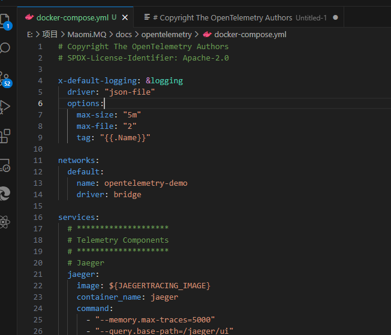
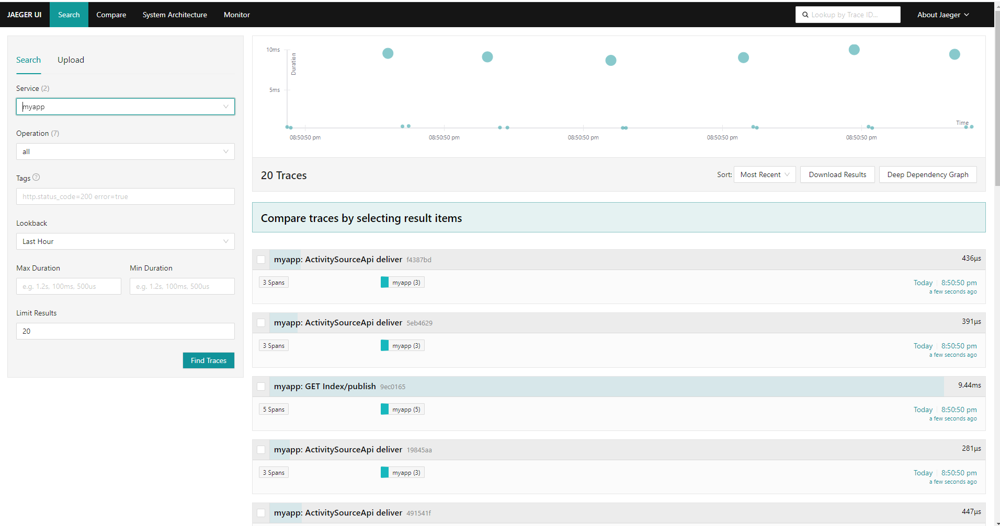
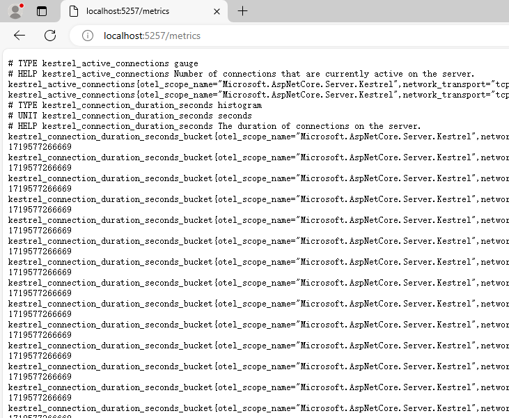

# 可观测性

功能还在继续完善中。请参考 ActivitySourceApi 示例。


### 部署环境

为了快速部署可观测性平台，可以使用 OpenTelemetry 官方提供的示例包快速部署相关的服务。

下载示例仓库源码：

```csharp
git clone https://github.com/open-telemetry/opentelemetry-demo.git
```


由于示例中会包含大量的 demo 微服务，因此我们需要打开 [docker-compose.yml](https://github.com/open-telemetry/opentelemetry-demo/blob/main/docker-compose.yml) 文件，将 services 节点的 `Core Demo Services` 和 `Dependent Services` 服务直接删除，只保留可观测性组件。或者直接点击下载笔者已经修改好的版本： [docker-compose.yml](opentelemetry/docker-compose.yml) 




执行命令部署可观测性服务：

```bash
docker-compose up -d
```


opentelemetry-collector-contrib 用于收集链路追踪的可观测性信息，有 grpc 和  http 两种，监听端口如下：

| Port | Protocol | Endpoint     | Function                                                     |
| :--- | :------- | :----------- | :----------------------------------------------------------- |
| 4317 | gRPC     | n/a          | Accepts traces in [OpenTelemetry OTLP format ](https://github.com/open-telemetry/opentelemetry-proto/blob/main/docs/specification.md) (Protobuf). |
| 4318 | HTTP     | `/v1/traces` | Accepts traces in [OpenTelemetry OTLP format ](https://github.com/open-telemetry/opentelemetry-proto/blob/main/docs/specification.md) (Protobuf and JSON). |

> 经过容器端口映射后，对外端口可能不是 4317、4318 了。


引入 Maomi.MQ.Instrumentation 包，以及其它相关 OpenTelemetry 包。

```csharp
<PackageReference Include="Maomi.MQ.Instrumentation " Version="1.1.0" />
<PackageReference Include="OpenTelemetry.Exporter.Console" Version="1.8.1" />
<PackageReference Include="OpenTelemetry.Exporter.OpenTelemetryProtocol" Version="1.8.1" />
<PackageReference Include="OpenTelemetry.Extensions.Hosting" Version="1.8.1" />
<PackageReference Include="OpenTelemetry.Instrumentation.AspNetCore" Version="1.8.1" />
```


引入命名空间：

```csharp
using OpenTelemetry.Logs;
using OpenTelemetry.Metrics;
using OpenTelemetry.Resources;
using OpenTelemetry.Trace;
using Maomi.MQ;
using OpenTelemetry.Exporter;
using RabbitMQ.Client;
using System.Reflection;
using OpenTelemetry;
```


### 链路追踪


使用链路追踪时，如下代码注入服务：

```csharp
const string serviceName = "myapp";

builder.Services.AddMaomiMQ((MqOptionsBuilder options) =>
{
	options.WorkId = 1;
	options.AutoQueueDeclare = true;
	options.AppName = serviceName;
	options.Rabbit = (ConnectionFactory options) =>
	{
		options.HostName = "192.168.3.248";
		options.ClientProvidedName = Assembly.GetExecutingAssembly().GetName().Name;
	};
}, [typeof(Program).Assembly]);

builder.Services.AddOpenTelemetry()
	  .ConfigureResource(resource => resource.AddService(serviceName))
	  .WithTracing(tracing =>
	  {
		  tracing.AddMaomiMQInstrumentation(options =>
		  {
              options.Sources.AddRange(MaomiMQDiagnostic.Sources);
			  options.RecordException = true;
		  })
		  .AddAspNetCoreInstrumentation()
		  .AddOtlpExporter(options =>
		  {
			  options.Endpoint = new Uri("http://127.0.0.1:32772/v1/traces");
			  options.Protocol = OtlpExportProtocol.HttpProtobuf;
		  });
	  });
```


启动服务后，进行发布、消费，链路追踪信息会被自动推送到 OpenTelemetry Collector 中，通过 Jaeger 、Skywalking 等组件可以读取出来。


打开映射了 16686 端口的 Jaejer ui 面板：




由于 publish、consumer 属于兄弟 trace 而不是同一个 trace，因此需要通过 Tags 查询相关联的 trace，格式 `event.id=xxx`。


### 监控

直接配置 Metrics 推送地址即可：

```csharp
builder.Services.AddOpenTelemetry()
	  .ConfigureResource(resource => resource.AddService(serviceName))
	  .WithTracing(tracing =>
	  {
		  tracing.AddMaomiMQInstrumentation(options =>
		  {
			  options.Sources.AddRange(MaomiMQDiagnostic.Sources);
			  options.RecordException = true;
		  })
		  .AddAspNetCoreInstrumentation()
		  .AddOtlpExporter("trace", options =>
		  {
			  options.Endpoint = new Uri("http://10.1.0.6:32774/v1/traces");
			  options.Protocol = OtlpExportProtocol.HttpProtobuf;
		  });
	  })
	  .WithMetrics(metrices =>
	  {
		  metrices.AddAspNetCoreInstrumentation()
		  .AddMaomiMQInstrumentation()
              // 这里用不了，可能 opentelemetry-demo 的服务跟当前 C# 库的 metrics 协议不兼容
		  .AddOtlpExporter("metrics", options =>
		  {
			  options.Endpoint = new Uri("http://10.1.0.6:32774/metrics");
			  options.Protocol = OtlpExportProtocol.HttpProtobuf;
		  })
              // 这里可以用
		  .AddPrometheusExporter();
	  });
```


添加中间件

```csharp
app.UseAuthorization();

// 添加这里
app.MapPrometheusScrapingEndpoint();

app.MapControllers();
```


修改 src/prometheus/prometheus-config.yaml 

```yaml
global:
  evaluation_interval: 30s
  scrape_interval: 5s
scrape_configs:
- job_name: otel-collector
  static_configs:
  - targets:
    - 'otelcol:8888'
- job_name: maomimmq
  static_configs:
  - targets:
    - '10.1.0.5:5257'
```


重启 Prometheus 。


启动程序，代码 `/metrics`。




### 开源项目代码引用

`OpenTelemetry.Instrumentation.MaomiMQ` 项目的 Includes 代码来源于 https://github.com/open-telemetry/opentelemetry-dotnet-contrib/tree/main/src/Shared

